# Introduction

## References
* [FHIR Tutorials](https://fhir-drills.github.io/index.html)
* [hl7.org FHIR Overview](https://www.hl7.org/fhir/overview.html)
* [hl7.org Base Resource Definitions](https://www.hl7.org/fhir/resource.html)
* [HAPI FHIR](http://hapi.fhir.org/)

FHIR (Fast Healthcare Interoperability Resources) is a standard for exchanging healthcare information electronically. The basic building block in FHIR is a resource. 
Some resources include Patient, Encounter, Observation, Appointment etc.\
FHIR resources are stored in some persistent store such as classic SQL database, NoSQL servers etc. \
FHIR Server provides a RESTful API to interact with these resources. FHIR Server is any software that implements the FHIR APIs and uses FHIR resources to exchange data.

A Patient record is generally created and maintained by each organization providing care for a patient. A patient receiving care at multiple organizations may therefore have its information present in multiple Patient Resources.

## 1. Resource Identity

### 1.1 Logical ID
Every FHIR resource has an `id` element which contains the “logical id” of the resource. This id is assigned by the FHIR server.
Location of a resource instance is an absolute URI `[base]/[type]/[id]`. \
E.g. `http://test.fhir.org/rest/Patient/123` (where 123 is the Logical Id of a Patient resource)

### 1.2 Business Identifiers
Business identifiers refer to the “real world entity” and is found in the identifier element, which has the type [Identifier](https://www.hl7.org/fhir/datatypes.html#Identifier)

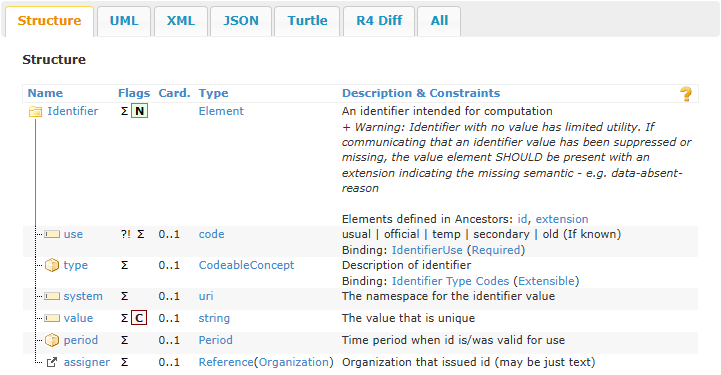

The `value` SHALL be unique within the defined `system` and have a consistent meaning wherever it appears. `Identifier.system` is always case sensitive. `Identifier.value` is to be treated as case sensitive unless knowledge of the `Identifier.system` allows the processer to be confident that non-case-sensitive processing is safe.

The `system` is a URI that defines a set of identifiers (i.e. how the `value` is made unique). It might be a specific application or a recognized standard/specification for a set of identifiers or a way of making identifiers unique.

In addition to the `system` (which provides a uniqueness scope) and the `value`, identifiers may also have a `type`, which may be useful when a system encounters identifier with unknown system values. It SHOULD not be used for codes that correspond 1..1 with the Identifier.system. Some identifiers may fall into multiple categories due to common usage. Where the system is known, a type is unnecessary because the type is always part of the system definition. However, systems often need to handle identifiers where the system is not known. There is not a 1:1 relationship between type and system, since many different systems have the same type.

## 2. Base Operations

### 2.1 Read - GET

HTTP GET is used to retrieve existing resource using a resource id or search parameters.\
Command: `GET [base]/[type]/[id]`

For example: URL to get a Patient Resource from a FHIR server:
`https://{BaseURL}/Patient/{id}`
where `{id}` tells the server which particular Patient resource we want.

FHIR resources can be expressed in either JSON or XML.
HTTP header `Accept` tells the server what format we want the data to be returned in. `Accept` can have these values: `application/fhir+xml` or `application/fhir+json`.

**Example**
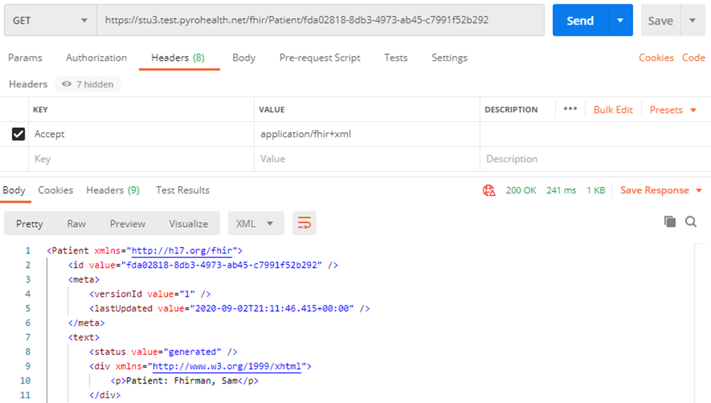

If you want a count of a certain resource after a certain time, the following query could be used.

`GET {base}/ExplanationOfBenefit?_lastUpdated=gt2021-04-13T16:10:00&_summary=count`

### 2.2 Update - PUT

HTTP PUT is used to update existing resource identified by resource id.\
Command: `PUT [base]/[type]/[id]`

HTTP header `Content-Type` tells the server what format the content we are sending is in. `Content-Type` can have these values: `application/fhir+xml` or `application/fhir+json`.

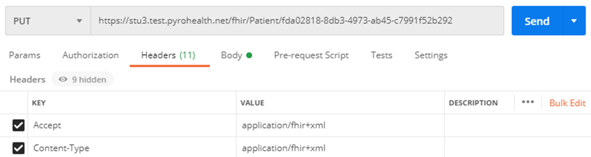

### 2.3 Create - POST

HTTP POST is used to add new resources, there must not be an id in the URL or the resource’s content.
The server will assign its own id to the resource.
Command: `POST [base]/[type]`

For example: to add a new Patient to the FHIR server, use `HTTP POST https://{BaseURL}/Patient`

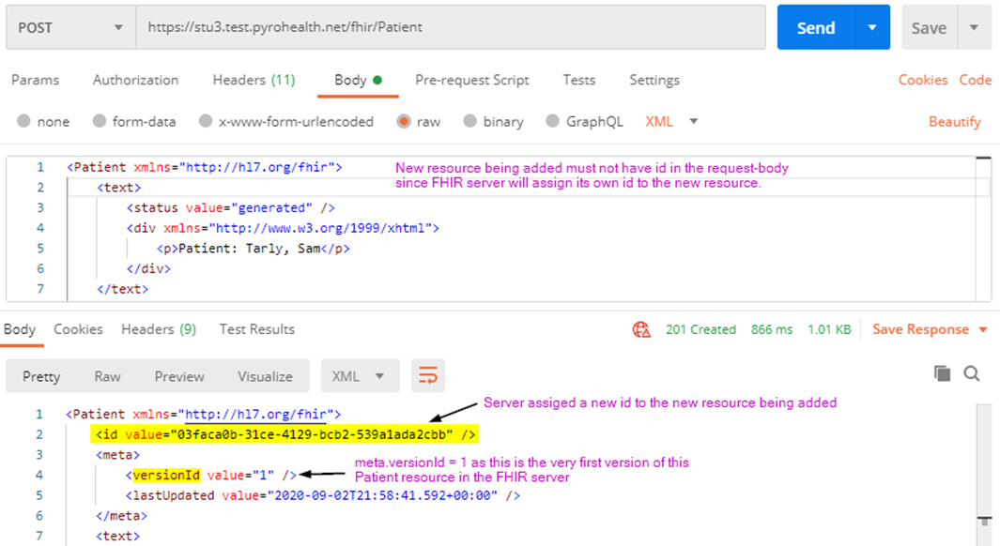

Generally, HTTP PUT can also add a new resource if no resource is found for the given id. However, this doesn’t work with HAPI FHIR server. If you use HTTP PUT to add a new resource, then you’ll get an error like this *“Can not create resource with ID[8], no resource with this ID exists and clients may only assign IDs which contain at least one non-numeric character”*

### 2.4 Delete - DELETE

HTTP DELETE is used to delete a resource from the FHIR server, where the resource is identified by an id.\
Deleting a resource is considered a version update.\
Command: `DELETE [base]/[type]/[id]`

#### Expunge

By default, when we execute HTTP DELETE on a FHIR Server, it performs a “logical” delete. This means that data is not physically removed from the database.
In some cases, it may be required to truly delete data. The `$expunge` operation is a powerful operation that can physically delete old versions of resources, deleted resources, or even all data in the database. 
Reference: https://smilecdr.com/docs/fhir_repository/deleting_data.html#expunge

Note that this operation is globally disabled by default as it is potentially dangerous.

Execute `HTTP DELETE` on a particular resource instance or cascade delete – *performs logical delete*.

Execute `HTTP POST [base]/$expunge` with these settings – *physically delete all the logically deleted resources including their history*.

Note – these parameters are provided as examples only and can be tweaked as per requirements. For details on these parameters, please refer https://smilecdr.com/docs/fhir_repository/deleting_data.html#expunge

```json
{
  "resourceType": "Parameters",
  "parameter": [
    {
      "name": "limit",
      "valueInteger": 1000
    },{
      "name": "expungeDeletedResources",
      "valueBoolean": true
    },{
      "name": "expungePreviousVersions",
      "valueBoolean": false
    },{
      "name": "expungeEverything",
      "valueBoolean": false
    }
  ]
}
```
### 2.5 Resource History - GET

Every update you make to a resource is kept on the FHIR server and each update increments a version number. This version number is known as the `meta.versionId`.

To retrieve a specific version of the Patient resource, use `HTTP GET` with `_history/[versionId you want to retrieve]`.\
E.g. `https://{BaseURL}/Patient/{id}/_history/{versionId}`

## 3. Search Parameters

Refer: http://hl7.org/fhir/search.html

Search Parameters allow you to locate resources given certain information you know about them.

Command: `GET [base]/[type]?name=value&..`

Let’s say you want to find the Patient resource(s) by searching on a family name.
So, you will use `HTTP GET [base]/Patient?family=[family-name]`.

The server returns the results in the HTTP response as a `Bundle` resource. A `Bundle` is used in FHIR to gather a collection of resources into a single instance.
Search parameters are resource type dependent and there are also common parameters that apply to all resources.

For example, here are some of the search parameters for Patient resource.
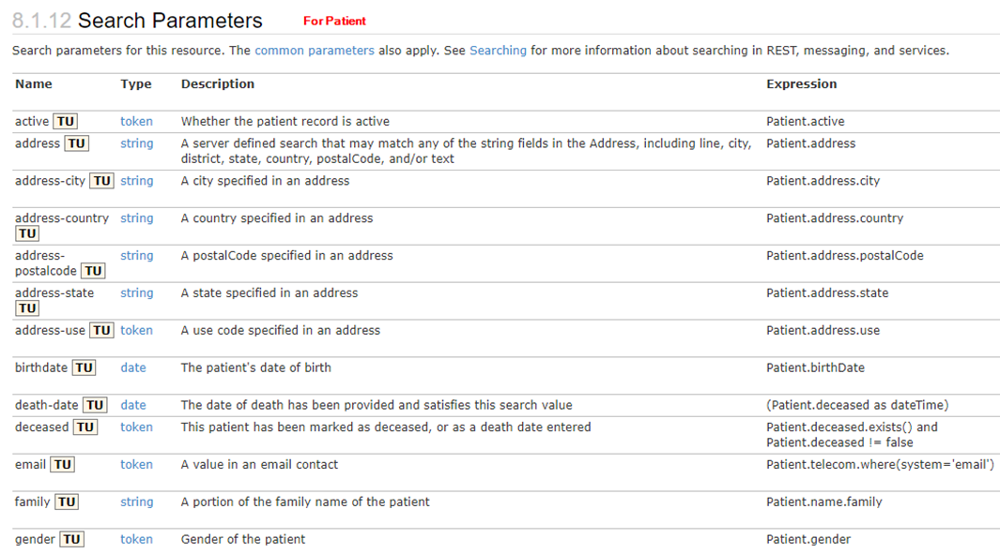

## 4. Resource References

### 4.1 Overview

FHIR resources are referenced or linked in one direction only. For example – a Patient will not be linked to any of the Observations / Procedures / Encounters; instead all Observations / Procedures / Encounters will be linked to the Patient.

This is an optimization measure - it means that as you add more Observations etc., you do not have to keep updating your Patient resource with the new references. This also means that the Patient doesn't have an explicit link to any of the Observations / Procedures / Encounters etc.

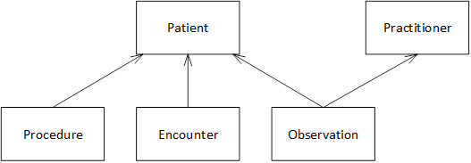

You can find these references from the FHIR specification for a specific resource.

E.g. Patient resource mentions it is referenced by Encounter, Observation, Procedure etc.

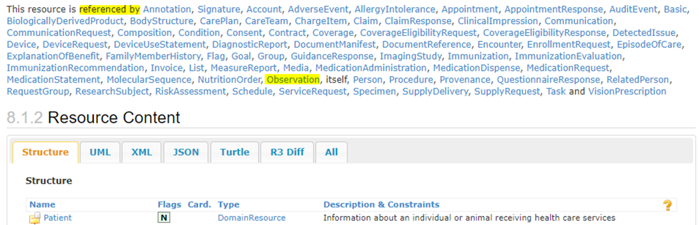

E.g. Observation resource has a subject field which references Patient.

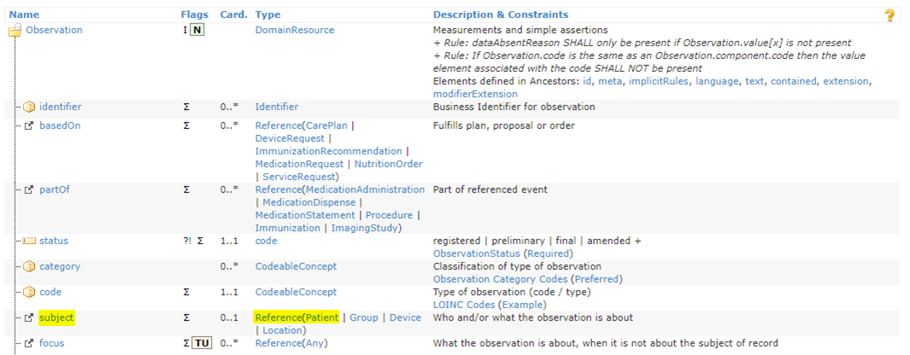

Note – parent resource must be present before a child resource can be added to the HAPI FHIR server.
E.g. if you try to add an Observation that refers to a Practitioner that is not yet added to the FHIR server, then you’ll get an error like this *“Resource Practitioner/f005 not found, specified in path: Observation.performer”*.

### 4.2 Search for a resource using a reference

**Sample Use-case:** Search for all Encounters or Observations for a given Patient.

**Encounter search**\
From the FHIR specification for the Encounter resource --> Search Parameters has one named `patient` which allows us to search for the patient present in the encounter.


Command: `GET [base]/Encounter?patient=Patient/[patient-id]`

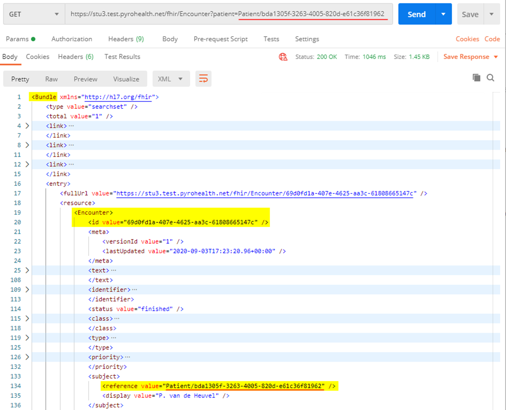

**Observation search**\
Below screenshot shows search result from searching all observations for a given patient.

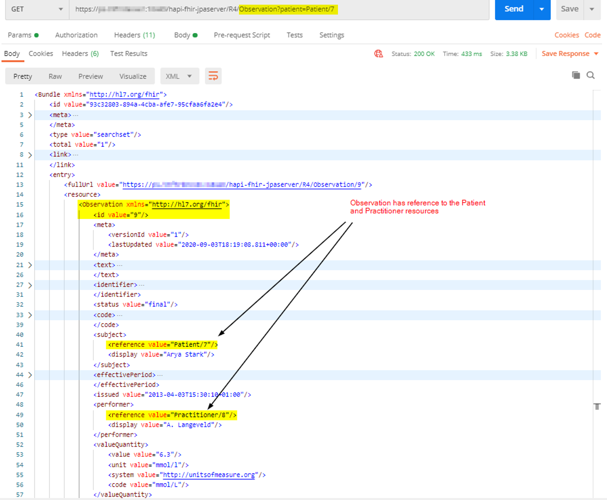

**Bundle with multiple observations**\
Screenshot showing a Bundle resource with multiple observations for a given patient.

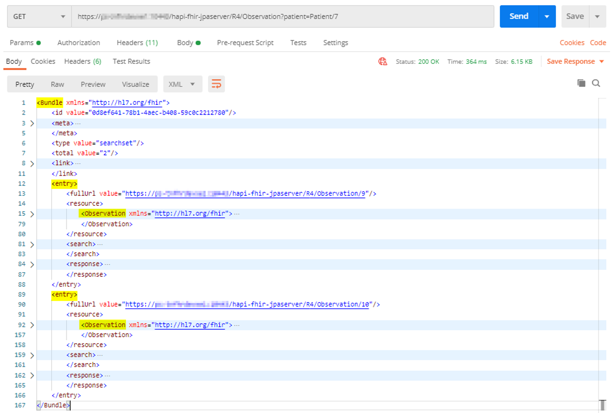

## 5. Bundle

A Bundle is a container for a collection of resources.\
Each resource in a bundle can have an independent existence and can be accessed directly using the RESTful API. 

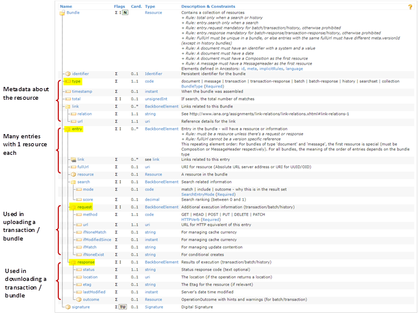

### 5.1 Bundle Types

| **Bundle Type** | **Description** |
| --- | --- |
| searchset | The bundle collects search results into a single response. |
| history | Similar to searchset but specialized for the _history operation on a single instance of a resource. E.g. looking at a particular patient history. |
| batch | Combine multiple operations into one. If one of the operations of a batch fails, then the rest of the operations can still complete successfully. |
| batch-response | Response from the server where it indicates what happened with each operation within the batch bundle. |
| transaction | Similar to batch but operations are performed as a single atomic transaction where the entire set of changes succeed or fail as a single entity. |
| transaction-response | Response from the server. |
| document, message, collection | Used in specific data exchange paradigms. |

### 5.2 Resolving references in Bundles

Refer: http://hl7.org/fhir/bundle.html#references

References between resources within a Bundle can come in two types:
1. Reference to resources where each resource is within the Bundle but not on the FHIR Server.
    * How do you reference a resource if the FHIR Server hasn’t assigned an id to it yet?
    * Bundle creator can assign temporary ids to the resources in order to create references between each resource within the Bundle.
    * Depending on the way you upload the Bundle to the server, FHIR Server can use these ids to understand the linkage between the resources and will assign its own server ids and update all references with the new ids.
    * FHIR Server will then reply with a return Bundle that informs the sender of these updated ids.
    * Whether the server performs this identification or not is dependent on the Bundle type you are uploading and the endpoint you are uploading it to.

2. Reference from resources in the Bundle to resources that are on the FHIR Server but not within the Bundle.

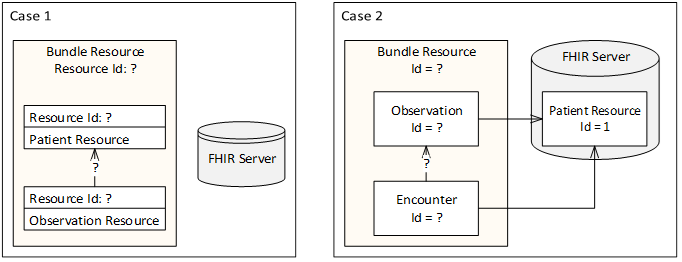

| **Bundle Type** | **Effect on Bundle upload** |
| --- | --- |
| batch | You cannot reference other resources inside the Bundle - thus all resources inside a batch Bundle must be completely independent, only reference resources already created on the server, or resources available on other servers. |
| transaction | You can reference other resources inside the Bundle using their business identifiers in a simplified search query. It is then on the server to replace the search query with the resource ID's when processing the Bundle. |

**Scenarios**

Bundle with a Patient and a bunch of Observations.\
How do you create this Bundle when you don’t know which resource is present in FHIR server and which isn’t?\
Update the resource if it’s present and add a new resource if it’s not present. How do you accomplish this?

Ref: https://cloud.google.com/healthcare/docs/how-tos/fhir-bundles

### 5.3 Use-Case: HL7 to FHIR: Bundle

Requirement: Add new resources to FHIR server or update existing resources depending on what data is present in input HL7 file\
Input: HL7 ADT01\
Output: FHIR Bundle of type transaction

1. Identify FHIR resources to map to depending on input data.

| HL7 | FHIR Resource |
| --- | --- |
| PID | Patient |
| PV1 | Practitioner |
| OBX | Observation |
| AL1 | AllergyTolerance |

2. Map input data to FHIR Bundle.\
Some key points for resource identification and resource references explained with examples.

| Mapping | Comment | 
| --- | --- |
| Bundle/type/@value | transaction |
| Bundle/entry/resource/Patient/identifier/value/@value | **Business identifier** that identifies the ‘real world entity’. Examples: <ul> <li>SHA-256 code of concatenated fields from PID segment.</li> <li>Primary key for the patient from an existing SQL database.</li></ul>|
| Bundle/entry/resource/Patient/id/value/@value | **Logical id** of the resource assigned by the FHIR server. You could map same value to identifier and id but note that FHIR server will assign its own ‘id’ to the resource. |
| Bundle/entry/resource/request/url/@value | Patient, Observation, Practitioner etc. |
| Bundle/entry/resource/request/method/@value | POST |
| Bundle/entry/resource/request/ifNoneExist/@value | identifier={identifier value mapped in resource} <ul><li>`ifNoneExist` instructs the server not to perform the create if a specified resource already exists.</li></ul>
| Bundle/entry/resource/Observation/subject/identifier/value/@value | {identifier} value of the referenced resource. E.g. Patient.identifier |
| Bundle/entry/resource/Observation/subject/reference/@value | You can map the same value as subject.identifier.value. E.g. Patient/{identifier} |

3. Sort the resources in FHIR bundle.
4. Upload the FHIR bundle to FHIR server.

Below sample screenshot (truncated and only showing the relevant fields) shows resource references in a FHIR bundle.


### 5.4 Use-Case: Add or update an Observation for an existing Patient

**Command** `HTTP PUT [base]/Observation?identifier={business-id}`

**Snippet of the HTTP request**

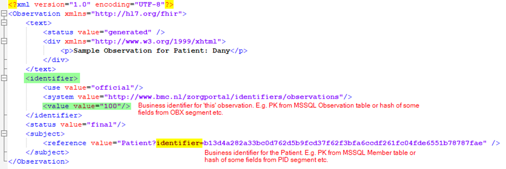

* Observation.identifier will become the business identifier of this Observation resource in the FHIR server.
* Observation.subject.reference points to the Patient resource identified by its business identifier.

**Example** 


Update Observation that has identifier=100.\
Note that unlike ‘id’ (that is assigned by the FHIR server), identifier is not guaranteed to be unique.

* CREATE: If observation with identifier=100 is not found, then a new observation will be created in the FHIR server.
* UPDATE: If only 1 observation with identifier=100 is found, then it’ll be updated.
* ERROR: If multiple observations with identifier=100 are found, then the PUT operation will fail with an error like this *“Failed to UPDATE resource with match URL "Observation?identifier=100" because this search matched 2 resources”*.
