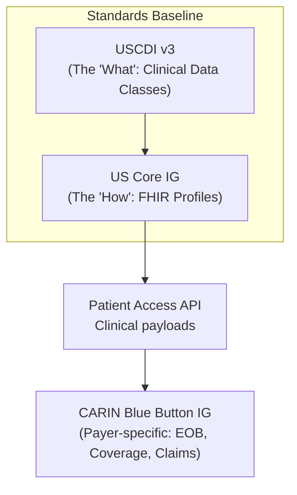
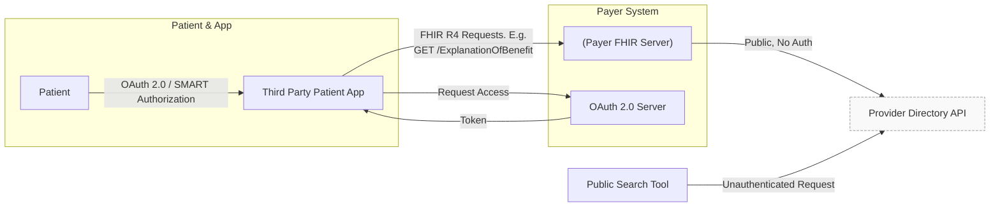
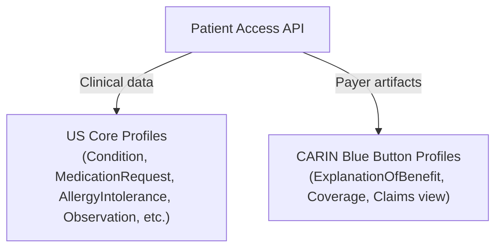
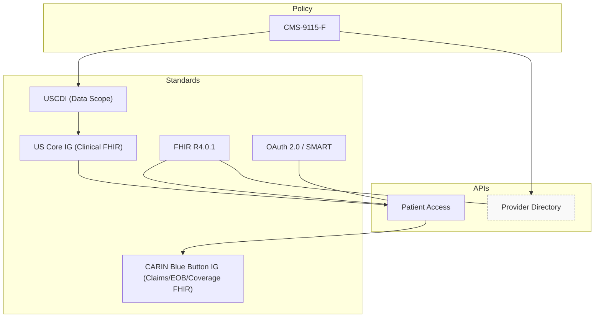

# CMS-9115-F: Interoperability and Patient Access

> This file explains CMS‑9115‑F conceptually; it is not a compliance checklist or implementation guide. As of 2026, many parts of this mandate have been expanded by the newer CMS-0057-F rule.

## What CMS-9115-F Is Trying to Achieve

CMS-9115-F focuses on Patient Empowerment. It mandates that patients have the right to access their own claims, encounter, and clinical data through the third-party smartphone applications of their choice.

CMS-9115-F focuses on data access and exchange.
The rule is designed to ensure that patient data can move freely between patients, providers, and payers using standardized APIs.

The primary goal is reducing data silos, not introducing new workflows.

## Who This Rule Applies To

This rule primarily impacts payers participating in CMS programs, including Medicare Advantage, Medicaid, CHIP, and ACA plans.

Providers and app developers interact with the APIs, but payers are responsible for exposing them.

## Required Technical Capabilities

At a high level, CMS-9115-F requires payers to:
- Expose patient data via APIs
- Support third-party application access
- Use standardized security and data formats

To comply, payers must implement three core "pillars" of interoperability:
1. **Patient Access API:** Allows patients to connect third-party apps to their insurance data.
2. **Provider Directory API:** A public-facing list of in-network providers and pharmacies.
3. **Payer-to-Payer Exchange (Conceptual):** Originally introduced here, but the FHIR-based technical requirement was later refined and mandated in CMS-0057-F.

## What Data Must Be Exposed: USCDI and US Core

CMS-9115-F does not allow payers to use proprietary data formats. Instead, it mandates a "standardized language."

The Data Hierarchy: USCDI → US Core → FHIR APIs (+ CARIN for Patient Access)

This diagram shows how CMS‑9115‑F defines a minimum clinical data scope (USCDI), maps it to FHIR (US Core), and exposes it through APIs - with CARIN Blue Button extending Patient Access for payer‑specific data.

1. **USCDI (The "What")**

USCDI (United States Core Data for Interoperability) defines the scope of clinical data.

USCDI defines *what categories of clinical data* must be accessible, such as:
- Patient demographics
- Problems and conditions
- Medications
- Allergies
- Laboratory results
- Clinical notes

USCDI answers the question of **scope**: how much data is considered the minimum acceptable level of interoperability.

> **2026 Update:** While the mandate started with USCDI v1, as of **January 1, 2026**, systems are transitioning to **USCDI v3**, which includes more robust data classes like Social Determinants of Health (SDOH).

2. **US Core (The "How")**

US Core is the "bridge." It takes the clinical categories in USCDI and maps them to actual **FHIR Resources** (like `Condition`, `MedicationRequest`, and `Observation`).

**USCDI vs FHIR Resources**

USCDI itself is technology-neutral. It does not define APIs, endpoints, or resource structures.

FHIR is used to represent USCDI data electronically, and CMS relies on standardized FHIR profiles to do so consistently.

**Why US Core Exists**

US Core is a FHIR Implementation Guide that maps USCDI data classes to specific FHIR resources and elements.

In practice:
- USCDI defines *what data must be shared*
- US Core defines *how that data appears in FHIR*

Together, they ensure that patient and provider applications can retrieve clinical data in predictable, interoperable formats.

3. **CARIN Blue Button (The "Payer Data")**

Because USCDI is mostly *clinical*, it doesn't cover insurance claims or "Explanation of Benefits" (EOB). The **CARIN Blue Button IG** provides the FHIR profiles needed to share financial and claims data with the patient.

**Who talks to whom? (Actors & trust boundaries)**

The Patient Access API relies on the SMART App Launch Framework, which uses OAuth 2.0 and OpenID Connect to ensure the patient is in control of who sees their data.

## Patient Access API

The Patient Access API allows patients to authorize applications to retrieve their health data directly from payers. It combines clinical data with insurance claim data.

This API is built on:
- OAuth 2.0 for authorization
- FHIR for data formats
- Clinical data defined by USCDI
- US Core FHIR profiles for baseline clinical interoperability
- CARIN Blue Button IG for payer‑specific data

**Patient Access payloads at a glance (US Core + CARIN)**

In practice, Patient Access APIs expose a combination of:
* **Clinical Data:** Uses **US Core** profiles (Conditions, Labs, etc.).

* **Payer Data:** Uses the **CARIN Blue Button IG**. This is necessary because USCDI doesn't cover "Explanation of Benefits" (EOB) or "Claims," which are core to what a payer maintains.

> **2026 Update:** Under the newer CMS-0057-F rule, the Patient Access API must now also include **Prior Authorization** data.

## Provider Directory API
This API helps patients find doctors and helps providers coordinate care.

* **Public Access:** Unlike other APIs, this must be accessible without a login/password.

* **Standard:** Typically implemented using the **HL7 Da Vinci PDex Plan Net IG**.

* **Data:** Includes provider names, specialties, addresses, and network status.

## Summary Map
This map shows how the policy mandates connect to the technical standards.

---

## Provider Access and Payer-to-Payer APIs

While CMS-9115-F established the foundation for payer interoperability, it is important to distinguish its requirements from the subsequent CMS-0057-F rule

1. **Provider Access API:** This was formally finalized in **CMS-0057-F**. It allows a doctor's EHR to pull a patient's history directly from the payer. The Provider Access API supports care coordination by allowing providers to access relevant patient data from payers.

2. **Payer-to-Payer Exchange:** OMS originally paused enforcement of the 9115-F version because it lacked a technical standard. It has been replaced by a FHIR-mandated Payer-to-Payer API in **CMS-0057-F** (effective 2027).

