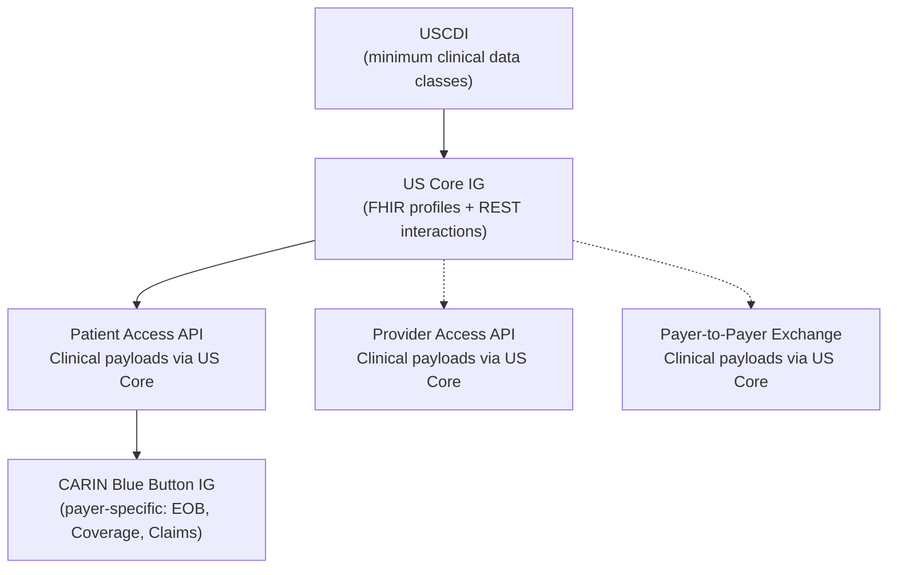
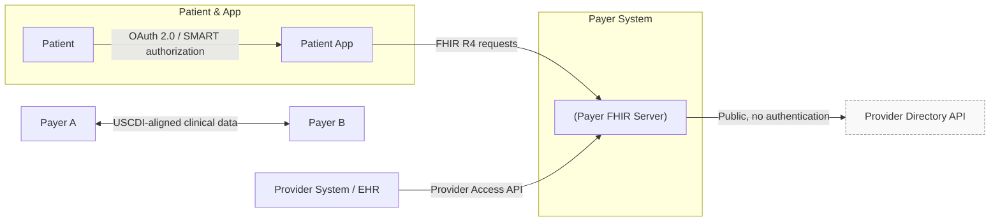
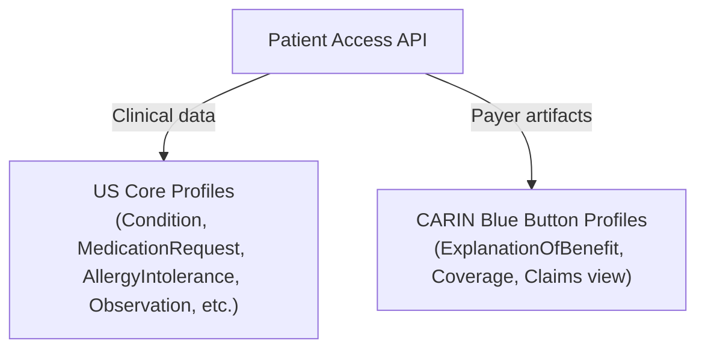
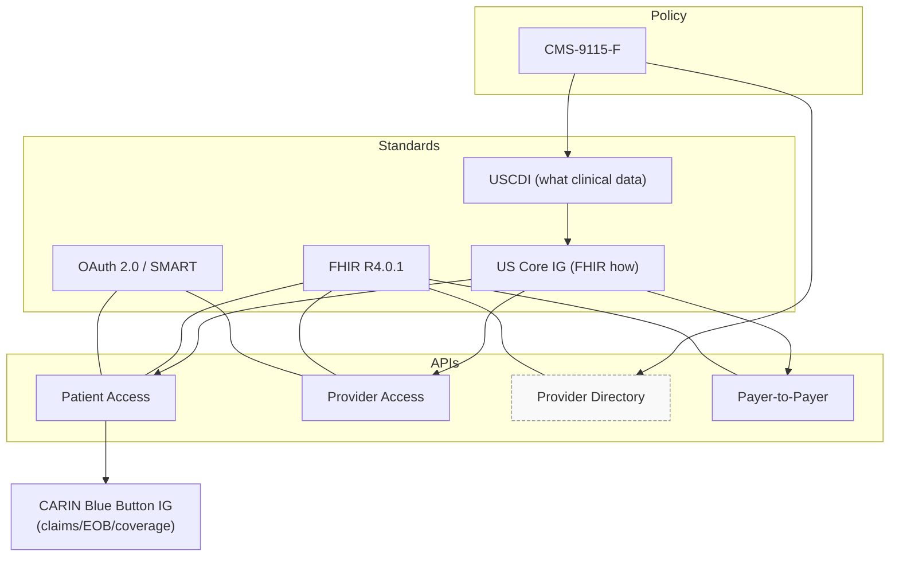

# CMS-9115-F: Interoperability and Patient Access

> This file explains CMS‑9115‑F conceptually; it is not a compliance checklist
or implementation guide.

## What CMS-9115-F Is Trying to Achieve

CMS-9115-F focuses on data access and exchange.
The rule is designed to ensure that patient data can move freely between
patients, providers, and payers using standardized APIs.

The primary goal is reducing data silos, not introducing new workflows.

## Who This Rule Applies To

This rule primarily impacts payers participating in CMS programs,
including Medicare Advantage, Medicaid, CHIP, and ACA plans.

Providers and app developers interact with the APIs, but payers are
responsible for exposing them.

## Required Technical Capabilities

At a high level, CMS-9115-F requires payers to:
- Expose patient data via APIs
- Support third-party application access
- Use standardized security and data formats

## What Data Must Be Exposed: USCDI and US Core

**Data scope and standards used by CMS‑9115‑F. USCDI → US Core → APIs (+ CARIN for Patient Access)**

This diagram shows how CMS‑9115‑F defines a minimum clinical data scope
(USCDI), maps it to FHIR (US Core), and exposes it through APIs - with
CARIN Blue Button extending Patient Access for payer‑specific data.

CMS-9115-F does not allow payers to expose arbitrary or proprietary datasets.
Instead, it mandates a minimum standardized dataset known as USCDI
(United States Core Data for Interoperability).

USCDI defines *what categories of clinical data* must be accessible,
such as:
- Patient demographics
- Problems and conditions
- Medications
- Allergies
- Laboratory results
- Clinical notes

USCDI answers the question of **scope**: how much data is considered
the minimum acceptable level of interoperability.

### USCDI vs FHIR Resources

USCDI itself is technology-neutral. It does not define APIs,
endpoints, or resource structures.

FHIR is used to represent USCDI data electronically, and CMS relies
on standardized FHIR profiles to do so consistently.

### Why US Core Exists

US Core is a FHIR Implementation Guide that maps USCDI data classes
to specific FHIR resources and elements.

In practice:
- USCDI defines *what data must be shared*
- US Core defines *how that data appears in FHIR*

Together, they ensure that patient and provider applications can
retrieve clinical data in predictable, interoperable formats.

**Who talks to whom? (Actors & trust boundaries)**

## Patient Access API

The Patient Access API allows patients to authorize applications
to retrieve their health data directly from payers.

This API is built on:
- OAuth 2.0 for authorization
- FHIR for data formats
- Clinical data defined by USCDI
- US Core FHIR profiles for baseline clinical interoperability
- CARIN Blue Button IG for payer‑specific data

**Patient Access payloads at a glance (US Core + CARIN)**

### US Core and CARIN Blue Button

US Core defines the baseline FHIR profiles used to represent USCDI clinical data,
such as conditions, medications, allergies, and laboratory results.

CARIN Blue Button extends this baseline by defining additional FHIR profiles
specific to payer use cases, including:
- Claims
- Coverage
- Explanation of Benefits

In practice, Patient Access APIs expose a combination of:
- US Core profiles for clinical data
- CARIN Blue Button profiles for payer‑specific data

CARIN Blue Button does not replace US Core; it builds on top of it
to add payer‑specific data needed for patient‑directed access.

## Provider Access API

The Provider Access API supports care coordination by allowing providers
to access relevant patient data from payers.

This API primarily exposes USCDI-aligned clinical data using
US Core FHIR profiles, but differs from Patient Access in its
authorization, trust relationships, and intended use cases.

## Provider Directory and Payer-to-Payer APIs

CMS-9115-F also requires:
- Provider Directory APIs to support discovery
- Payer-to-Payer APIs to enable continuity of care when patients switch plans

All of these APIs use the same foundational building blocks described earlier.

The Provider Directory API is publicly accessible and does not use
authentication or authorization.

The Payer‑to‑Payer requirements were later refined through additional
rulemaking, which is covered separately in CMS‑0057‑F.

## Summary Map

