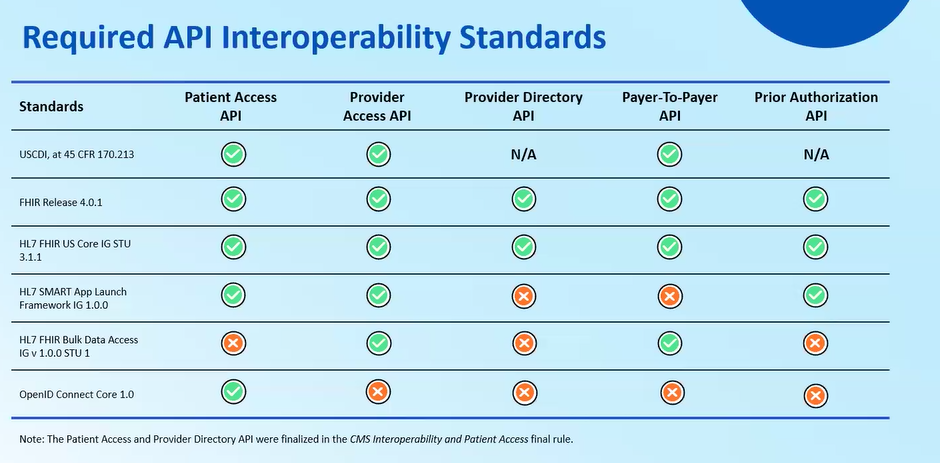
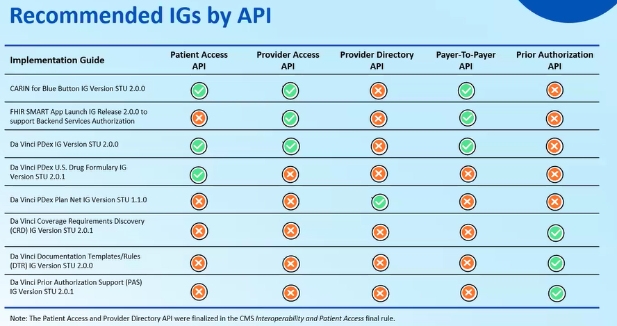

# CMS-0057-F: Prior Authorization and Workflow Automation

## Why Prior Authorization Is Different

Unlike patient access or data exchange, prior authorization is a
workflow problem, not just a data problem.

It involves requests, responses, decisions, and status changes over time.

Unlike CMS‑9115‑F, which focuses on making data available for retrieval,
CMS‑0057‑F focuses on automating an end‑to‑end business process.

The goal is not just access to information, but coordinated decision‑making
between providers and payers.

## What CMS-0057-F Introduces

CMS-0057-F requires payers to support electronic prior authorization
using standard APIs.

The rule aims to reduce delays, administrative burden, and manual processes.

## Required Technical Capabilities

To support automated prior authorization, systems must:
- Exchange structured requests and responses
- Support asynchronous workflows
- Use standardized clinical data

Asynchronous workflows are required because prior authorization decisions
often involve review steps that cannot be completed in a single request‑response
interaction.

## Prior Authorization API

The Prior Authorization API supports the submission and tracking
of authorization requests between providers and payers.

While it still uses FHIR and OAuth 2.0, the interaction pattern
is fundamentally different from data access APIs.

## Role of Da Vinci Implementation Guides

CMS relies heavily on the HL7 Da Vinci project for prior authorization.
Da Vinci IGs define how prior authorization requests, responses, and
supporting clinical data are represented in FHIR.

These guides exist because prior authorization requires workflow‑specific
semantics that go beyond basic data exchange.

Prior authorization highlights why CMS mandates extend beyond simple
resource retrieval APIs.

---

## Notes from CMS‑0057‑F Educational Session

### Scope of Prior Authorization in This Rule

One important clarification from CMS is that this rule **does not apply to drug prior authorization**.

When CMS refers to “prior authorization” in CMS‑0057‑F, it means:
- Prior authorization for **medical items and services**
- Not prescription drugs

Payers are **not restricted** from including drug prior authorization if they choose to,
but **they are not required to do so** under this rule.

CMS also mentioned that a **separate rule for drug prior authorization may be introduced in the future**.

---

### Why APIs Are Central to the Rule

Many of the policies in CMS‑0057‑F focus on using technology to streamline healthcare data sharing.

This is done primarily through **standards‑based APIs**.

FHIR is the chosen standard for interoperability because it enables:
- Consistent data exchange
- Automation instead of manual steps
- Shared expectations across systems

---

## Access APIs

Access APIs improve access to information and are mostly used to move information **from payers to an intended recipient**, such as a patient, a provider, or another payer.

### Patient Access API

The Patient Access API allows patients to access their own information using applications.

This API already exists today as part of CMS‑9115‑F and currently includes:
- Claims and encounter data
- Patient cost‑sharing information
- Clinical data defined by USCDI

CMS‑0057‑F **expands this API** to also include:
- Prior authorization information

Payers are also required to report **API use metrics** to understand how many patients are actually accessing their information through this API.

---

### Provider Access API

The Provider Access API is **new** under CMS‑0057‑F.

Impacted payers must implement and maintain this API to share patient data with **in‑network providers** who have a treatment relationship with the patient.

The API must make available:
- Claims and encounter data (excluding provider remittances and enrollee cost‑sharing information)
- USCDI clinical data
- Prior authorization information

Providers are allowed to request this information by default.
Patients must be given the ability to **opt out** of this use case.

---

### Payer‑to‑Payer API

Impacted payers must implement and maintain a Payer‑to‑Payer API to share data with other payers.

This data includes:
- Claims and encounter data (excluding provider remittances and enrollee cost‑sharing information)
- USCDI clinical data
- Prior authorization information

This API is used when:
- A patient changes health plans, or
- A patient has concurrent coverage with multiple payers

The goal is to reduce information loss and repeated work when coverage changes.

---

## Prior Authorization API

The Prior Authorization API is the core focus of CMS‑0057‑F.

Impacted payers must implement an API that automates three key parts of the prior authorization process:

1. **Determine whether prior authorization is required for a particular item or service**  
Providers should be able to check this instead of guessing.

2. **Identify payer‑specific documentation requirements**  
Providers need a clear way to understand what information is required.

3. **Submit a prior authorization request and receive a response**  
Providers can submit requests and receive approvals, denials, or requests for additional information using the API.

---

### Prior Authorization Decision Timeframes

CMS establishes clear expectations for response times:

- **Standard prior authorization requests:** decision within **7 calendar days**
- **Expedited prior authorization requests:** decision within **72 hours**

These timelines apply regardless of how the request is submitted.

---

### Denial Transparency

If a prior authorization request is denied, payers must provide:
- Clear reasons
- Specific explanations
- Actionable guidance

This requirement applies no matter how the request was submitted.

---

### Reporting and Metrics

Payers are required to report metrics about their prior authorization performance, including:
- Percentage of requests approved
- Percentage denied
- Percentage approved after appeal
- Average time between submission and decision

These metrics are intended to increase transparency and accountability.

---

### Provider Requirements

CMS described provider requirements at a high level as mostly **yes/no measures**.

---

### Supporting Standards and Guides

**Standards that support the APIs** 

**IGs that support each of the standards in the rule** 

---
