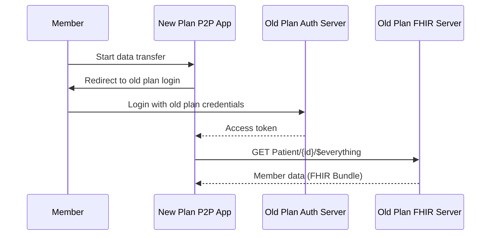
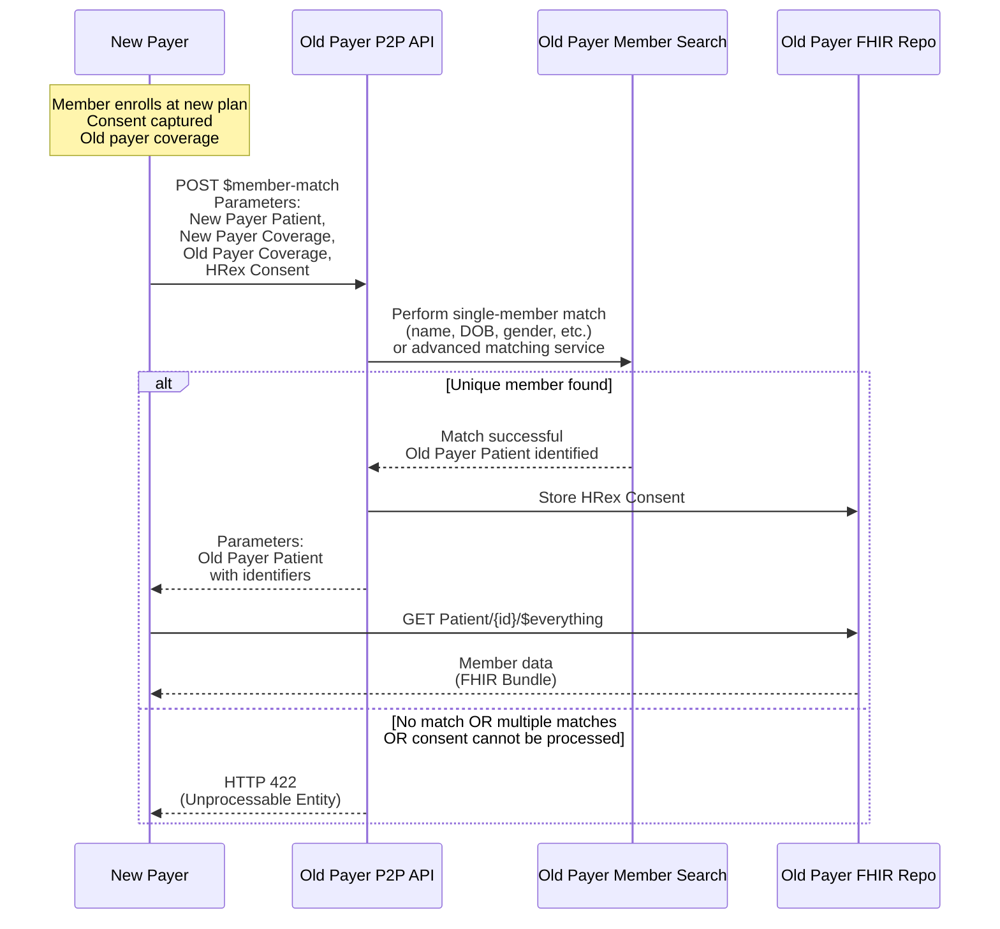
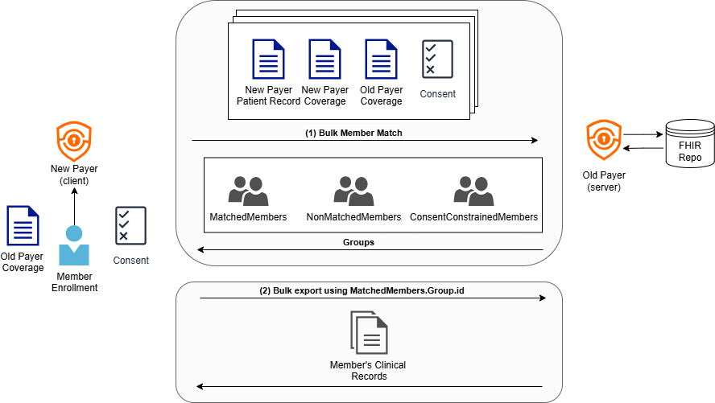
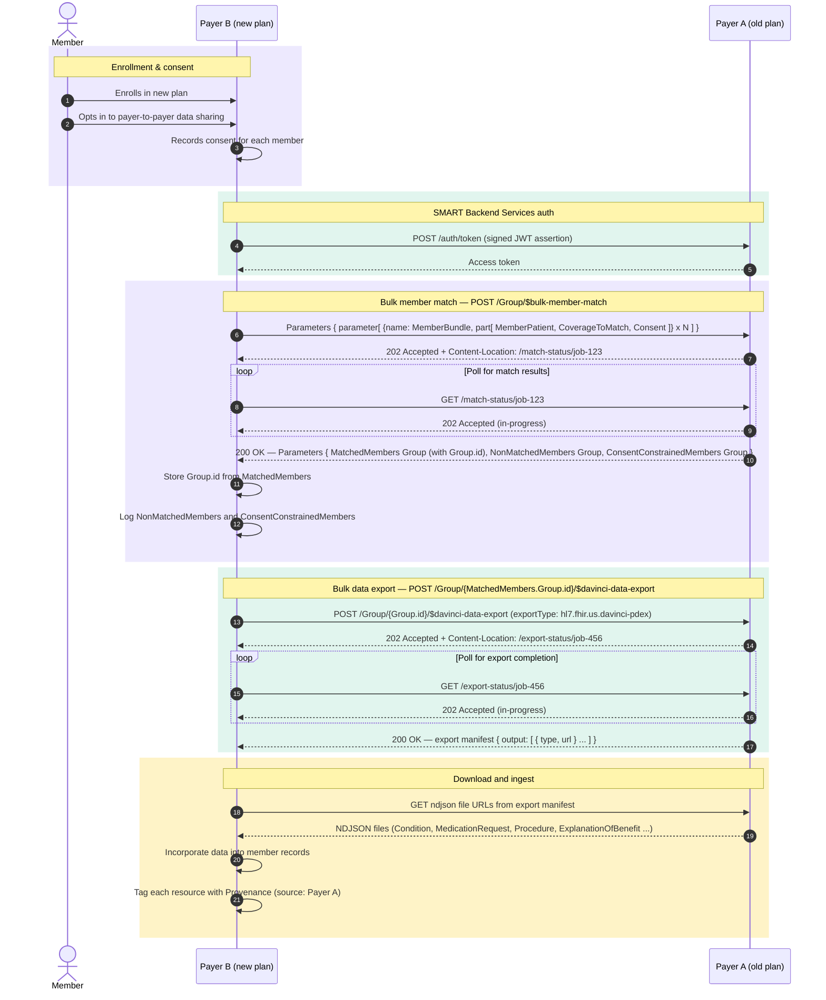

# Payer-to-Payer API

## References
* [PDex STU 0.1.0](https://hl7.org/fhir/us/davinci-pdex/2019Jun/index.html)
* [PDex STU 2.0.0](https://hl7.org/fhir/us/davinci-pdex/STU2/payertopayerexchange.html)
* [PDex STU 2.1.0: P2P single member](https://hl7.org/fhir/us/davinci-pdex/STU2.1/payertopayerexchange.html)
* [PDex STU 2.1.0: P2P bulk](https://hl7.org/fhir/us/davinci-pdex/STU2.1/payertopayerbulkexchange.html)
* [HRex Member Match](https://build.fhir.org/ig/HL7/davinci-ehrx/en/OperationDefinition-member-match.html)

## Problem Statement

When a patient changes health plans, their data often does not move with them.
New payers must re‑collect information like: Medications, Conditions, Coverage history etc.
This causes delays, duplicate work, and poor member experience.

CMS-0057-F is about making sure patient data can follow the patient when they move between payers. CMS-0057-F addressed this by mandating payer-to-payer data exchange using FHIR, through an HL7 specification called PDex (Da Vinci Payer Data Exchange). PDex explains how health plans (payers) can share a member's health history with providers, other payers, or apps. PDex defines how payer-to-payer data sharing should work using standard FHIR APIs. PDex has evolved over time as real‑world implementations exposed limitations and operational challenges.

## PDex STU 0.1.0 - Member-Initiated Exchange

### Key Concepts
* **Member Initiated:** The member initiates the payer‑to‑payer data exchange. The member authenticates directly with the old health plan using existing credentials.
* **No Member Match:** identity is established through login.
* **OAuth 2.0 token:** The old plan issues an access token to the new plan’s payer‑to‑payer application.
* Using the access token, the new plan retrieves data from the old plan using `GET Patient/{id}/$everything`.
* **Single Member:** Data is exchanged one member at a time.
* There is no bulk or asynchronous export in STU 0.1.0.

## PDex STU 2.0.0 - Payer-Mediated Exchange

STU 2.0.0 shifted the flow from member‑initiated login to payer‑mediated exchange with member matching, while still keeping the data exchange limited to a single member. The member still provides consent, but they don't need to actively log in to the old plan.

### Key Concepts
* The exchange is still limited to a **single member**.
* **Payer‑mediated:** the member does not log in to the old plan. The new payer drives the exchange using information the member provided at enrollment (their old insurance card details).
* **Single Member Match:** before any data is exchanged, the new payer calls `POST $member-match` on the old payer's system. HRex member match is used to identify the member at the old payer. The new payer sends patient, coverage, and consent information in a `Parameters` resource, and the old payer identifies the member before allowing data retrieval.
  > See the Member Match chapter for more details.
* **Single Member:** Once the member is matched, data for that one member is retrieved using `GET Patient/{id}/$everything`.
* Single‑member bulk export is not supported.

## PDex STU 2.1.0 - Bulk Exchange

Instead of one member at a time, Payer B sends all its members in a single request, waits for the old payer to process the batch, then pulls back everyone's data in one go. This is the version CMS-0057-F actually requires.

### High-Level Diagram

### Detailed Sequence Diagram

### Key Concepts
* Single member and multi-member data exchange
* Single and **bulk member match:** instead of calling `$member-match` once per member, Payer B bundles all its members into a single `POST /Group/$bulk-member-match` request. The old payer doesn't respond immediately — it returns a `202 Accepted` and a URL to check back on. Payer B polls that URL until the job is done.
* The old payer processes the batch asynchronously and returns three groups: members it matched (`MatchedMembers`), members it couldn't find or multiple matches (`NonMatchedMembers`), and members it found but whose consent couldn't be honored (`ConsentConstrainedMembers`). Only `MatchedMembers` Group has a `Group.id`.
  > See the Member Match chapter for the detailed request and response structure.
* **Single member data retrieval** using `$everything`
* **Multi-member data retrieval** using Group export. Payer B calls $davinci-data-export with the Group.id. Async pattern — poll until done, then collect an export manifest listing download URLs by resource type.
* Download and tag. Each URL is an NDJSON file — one FHIR resource per line, split by type (Conditions, Medications, Procedures, etc.). Payer B loads them in and stamps each resource with a Provenance pointing back to Payer A.

**Bulk Member Match: Request Details**
> See the Member Match chapter for the detailed request and response structure.

The bulk Payer-to-Payer exchange is initiated by supplying a `Parameters` resource to the `$bulk-member-match` operation.

For each member submitted to the bulk-member-match operation the following parameters can be supplied as a `parameter.part` element.
* `MemberPatient` - HRex Patient demographics
* `CoverageToMatch` - details of the prior health plan coverage, supplied by the member, typically from the health plan coverage card. Uses the HRex Coverage Profile
* `Consent` - Record of consent received by requesting payer from Member to retrieve their records from the prior payer. This is an **opt-in**. Uses the HRex Consent Profile
* `CoverageToLink` - Optional parameter. Details of new or prospective health plan coverage, provided by the health plan based upon the member’s enrolment. Uses the HRex Coverage Profile

