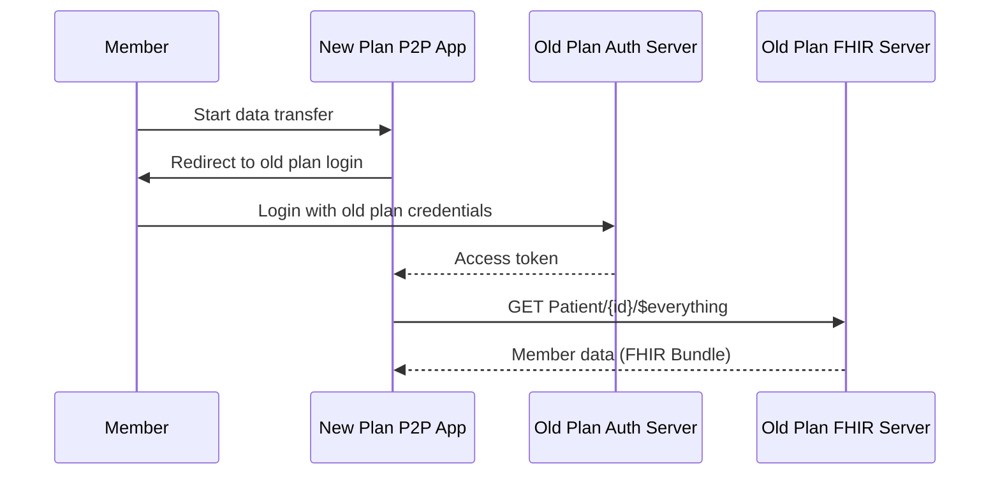
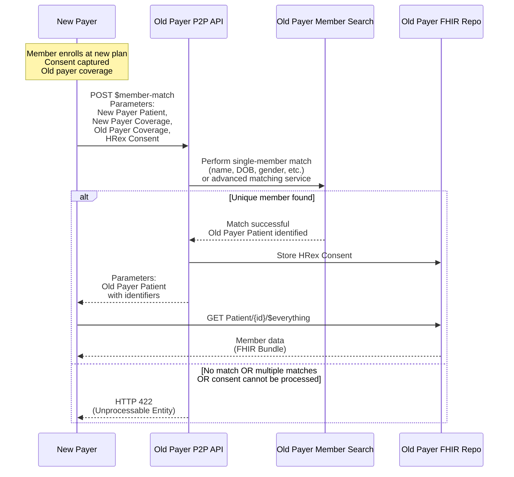

# Payer-to-Payer API

## References
* [PDex STU 0.1.0](https://hl7.org/fhir/us/davinci-pdex/2019Jun/index.html)
* [PDex STU 2.0.0](https://hl7.org/fhir/us/davinci-pdex/STU2/payertopayerexchange.html)
* [PDex STU 2.1.0: P2P single member](https://hl7.org/fhir/us/davinci-pdex/STU2.1/payertopayerexchange.html)
* [PDex STU 2.1.0: P2P bulk](https://hl7.org/fhir/us/davinci-pdex/STU2.1/payertopayerbulkexchange.html)
* [HRex Member Match](https://build.fhir.org/ig/HL7/davinci-ehrx/en/OperationDefinition-member-match.html)

## Problem Statement

When a patient changes health plans, their data often does not move with them.
New payers must re‑collect information like: Medications, Conditions, Coverage history etc.
This causes delays, duplicate work, and poor member experience.

CMS 0057F is about making sure patient data can follow the patient when they move between payers.

## PDex

The **HL7 Da Vinci Payer Data Exchange (PDex)** Implementation Guide explains how health plans (payers) can share a member's health history with providers, other payers, or apps. **PDex** defines how payer-to-payer data sharing should work using standard FHIR APIs. PDex has evolved over time as real‑world implementations exposed limitations and operational challenges.

## PDex STU 0.1.0

### Key Concepts
* **Member Initiated:** The member initiates the payer‑to‑payer data exchange.
* The member authenticates directly with the old health plan using existing credentials.
* **No Member Match:** identity is established through login.
* The old plan issues an access token to the new plan’s payer‑to‑payer application.
* Using the access token, the new plan retrieves data from the old plan using `GET Patient/{id}/$everything`.
* **Single Member:** Data is exchanged one member at a time.
* There is no bulk or asynchronous export in STU 0.1.0.

## PDex STU 2.0.0

STU 2.0.0 shifted the flow from member‑initiated login to payer‑mediated exchange with member matching, while still keeping the data exchange limited to a single member.

### Key Concepts
* The exchange is still limited to a **single member**.
* **Payer‑mediated:** the member does not log in to the old plan.
* **Single Member Match:** HRex member match is used to identify the member at the old payer.
* Once the member is matched, data is retrieved using `GET Patient/{id}/$everything`.
* **Single Member:** Data is returned for that one member only.
* Single‑member bulk export is not supported.

In PDex STU 2.0.0, the new payer identifies the member at the old payer using the HRex member match process. This replaces the member login flow used in STU 0.1.0. Once a single matching patient is found, that patient’s FHIR ID is used for data retrieval.