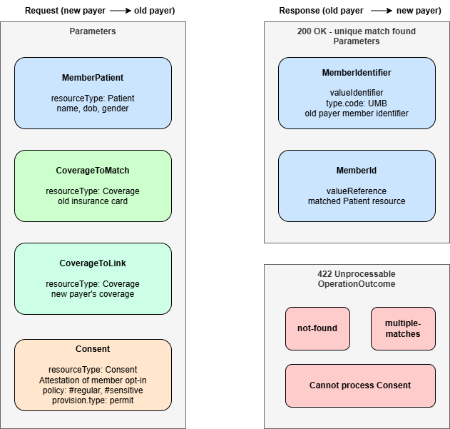

# Member Match

## References
* [HRex Member Match](https://hl7.org/fhir/us/davinci-hrex/OperationDefinition-member-match.html)
* [HRex Patient Demographics](https://hl7.org/fhir/us/davinci-hrex/StructureDefinition-hrex-patient-demographics.html)

## Member Match And Its Role In Payer-to-Payer Exchange

The `$member-match` operation can be invoked by either a payer or an EHR or other system, allows one health plan to retrieve a unique identifier for a member from another health plan using a member's demographic and coverage information.

Member match is a general HRex operation, and payer-to-payer exchange is one of the use-cases.

Before Payer B (new plan) can retrieve a member's record from Payer A (old plan), it needs to know what Payer A calls that member.

When Alice switches from Payer A to Payer B, Payer B knows Alice by her demographics and whatever information she supplied during enrollment - her old insurance card, for instance. But Payer's A FHIR server won't respond to "give me Alice's records". It needs a specific member identifier that lives only inside Payer A's system.

The `$member-match` operation solves this. It lets Payer B say to Payer A: *Here is everything I know about this person - demographics, new coverage, their old coverage, and their consent. Can you find them in your system and give me a stable identifier I can use for subsequent data requests?*

A successful match returns a Unique Member Identifier (UMB) - a FHIR identifier that Payer B must use in all subsequent interactions with Payer A for that member.

The `$member-match` operation is defined in **Da Vinci Health Record Exchange (HRex)**. When PDex talks about payer-to-payer exchange, it inherits member match from HRex.

## Single Member Match Request & Response

The new payer invokes `POST [base]/Patient/$member-match`.

The **request** body is a FHIR `Parameters` resource containing up to four named parameters.

| Parameter Name | Resource Type | Cardinality | Purpose |
| --- | --- | --- | --- |
| MemberPatient | Patient | 1..1 | Member demographics (name, DOB, gender) |
| CoverageToMatch | Coverage | 1..1 | OldCoverage: Old payer's coverage details (from the insurance card) |
| CoverageToLink | Coverage | 0..1 | NewCoverage: New payer's coverage information for the member |
| Consent | Consent | 0..1 | Attestation that the member opted in. Consent to share all information or only non-sensitive data |

The **response** is a FHIR `Parameters` resource.

| Parameter Name | Type | Cardinality | Purpose |
| --- | --- | --- | --- |
| MemberIdentifier |Identifier | 1..1 | Old payer member identifier information for the patient |
| MemberId | Reference | 0..1 | A reference to the matched `Patient` resource on old payer's system |




**Sample Request (relevant parts)**

```json
{
  "resourceType": "Parameters",
  "id": "member-match-in",
  "meta": { "profile": [
      "http://hl7.org/fhir/us/davinci-hrex/StructureDefinition/hrex-parameters-member-match-in"
    ]},
  "parameter": [
    {
      "name": "MemberPatient",
      "resource": {
        "resourceType": "Patient",
        "id": "1",
        "name": [{
            "family": "Person",
            "given": [
              "Ann"
            ]
          }],
        "gender": "female",
        "birthDate": "1974-12-25"
      }
    },
    {
      "name": "CoverageToMatch",
      "resource": {
        "resourceType": "Coverage",
        "id": "9876B1",
        "identifier": [{
            "system": "http://example.org/old-payer",
            "value": "DH10001235"
          }],
        "status": "draft"
      }
    },
    {
      "name": "CoverageToLink",
      "resource": {
        "resourceType": "Coverage",
        "id": "AA87654",
        "identifier": [{
            "system": "http://example.org/new-payer/identifiers/coverage",
            "value": "234567"
          }],
        "status": "active"
      }
    },
    {
      "name": "Consent",
      "resource": {
        "resourceType": "Consent",
        "status": "active",
        "policy": [{
            "uri": "http://hl7.org/fhir/us/davinci-hrex/StructureDefinition-hrex-consent.html#regular"
          }],
        "provision": {
          "type": "permit"
        }
      }
    }
  ]
}
```

**Sample Response (relevant parts)**

Matching behavior is:
* Single unique match and consent can be honored, old payer returns a `Parameters` resource.
* No match -> Return `HTTP 422` with an `OperationOutcome` that indicates the specific nature of the failure.
* Multiple matches -> Return `HTTP 422` with an `OperationOutcome` that indicates the specific nature of the failure.
* If consent is provided, inability to comply with consent requirements -> Return `HTTP 422` with an `OperationOutcome` that indicates the specific nature of the failure.

```json
{
  "resourceType": "Parameters",
  "id": "member-match-out",
  "meta": {
    "profile": [
      "http://hl7.org/fhir/us/davinci-hrex/StructureDefinition/hrex-parameters-member-match-out"
    ]
  },
  "parameter": [
    {
      "name": "MemberIdentifier",
      "valueIdentifier": {
        "type": {
          "coding": [
            {
              "system": "http://hl7.org/fhir/us/davinci-hrex/CodeSystem/hrex-temp",
              "code": "UMB"
            }
          ]
        },
        "system": "http://example.org/target-payer/identifiers/member",
        "value": "55678",
        "assigner": {
          "display": "Old Payer"
        }
      }
    },
    {
      "name": "MemberId",
      "valueReference": {
        "reference": "http://example.org/new-payer/fhir/Patient/pat1"
      }
    }
  ]
}
```

## Multi Member Match

