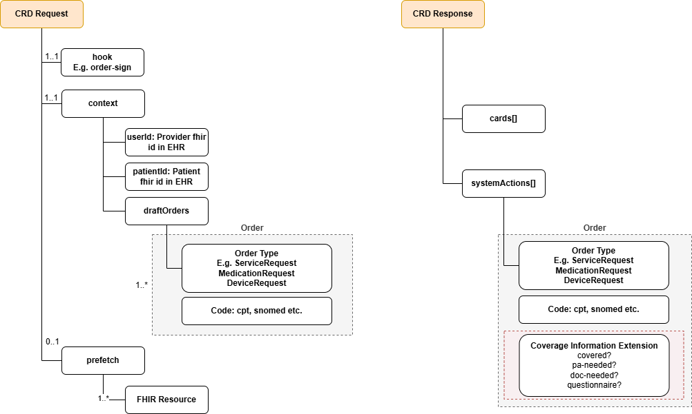
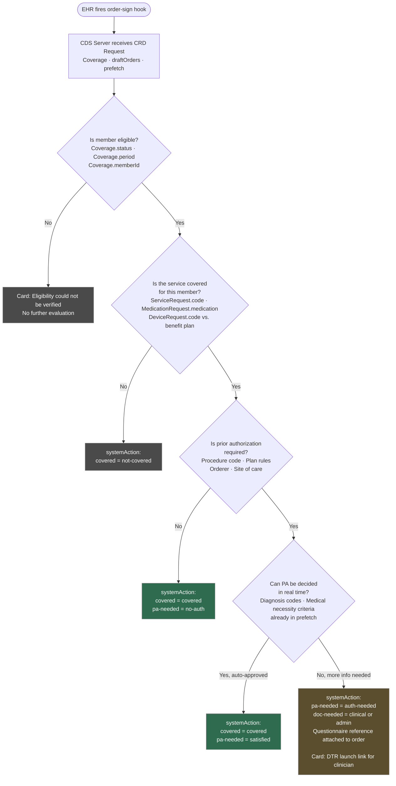

# CRD

## References
* [CDS Hooks](https://cds-hooks.hl7.org/)
* [Trusting CDS Services](https://cds-hooks.hl7.org/#trusting-cds-services)
* [CRD Request Logical Model](https://build.fhir.org/ig/HL7/davinci-crd/en/StructureDefinition-CRDHooksRequest.html)
* [CRD Request order-sign context](https://build.fhir.org/ig/FHIR/fhir-tools-ig/StructureDefinition-CDSHookOrderSignContext.html)
* [CRD Request draftOrders Bundle](https://build.fhir.org/ig/HL7/davinci-crd/en/StructureDefinition-profile-bundle-request.html)
* [CRD Response Logical Model](https://build.fhir.org/ig/HL7/davinci-crd//en/StructureDefinition-CRDHooksResponse.html)
* [Coverage Information Extension](https://build.fhir.org/ig/HL7/davinci-crd/en/StructureDefinition-ext-coverage-information.html)

## Discovery

Before the EHR can call a CDS Service, it needs to know what services are available. This is done through a discovery endpoint.

1. A CDS Service provider exposes its discovery endpoint at `{baseURL}/cds-services`. This endpoint returns JSON descriptions of all available CDS Hooks services.
2. The CDS Client (typically the EHR) retrieves this list by calling: `GET https://{baseURL}/cds-services`.
3. The response is an object containing a `services` array. Each entry describes one available CDS Service. Example:

```json
{
  "services": [
    {
      "hook": "order-select",
      "title": "Order Echo CDS Service",
      "description": "An example of a CDS Service that simply echoes the order(s) being placed",
      "id": "order-echo",
      "prefetch": {
        "patient": "Patient/{{context.patientId}}",
        "medications": "MedicationRequest?patient={{context.patientId}}"
      }
    },
    {
      "hook": "order-sign",
      "title": "Pharmacogenomics CDS Service",
      "description": "An example of a more advanced, precision medicine CDS Service",
      "id": "pgx-on-order-sign",
      "usageRequirements": "Note: functionality of this CDS Service is degraded without access to a FHIR Restful API as part of CDS recommendation generation."
    }
  ]
}
```

## Calling a CDS Service

### CRD Request

CDS Client (typically the EHR) calls a CDS service by `POST`ing a JSON document to `{baseUrl}/cds-services/{service.id}`. The request payload includes:
* `hook` (e.g., order-sign, order-select, appointment-book)
* `context` tells the CDS Service what is happening in the workflow - for example, which order is being placed and which patient it is for - so the payer can evaluate coverage requirements. A CRD request always applies to a single patient, but within that request the EHR may include multiple orders for that patient.
* Optional `prefetch` results - Data the EHR fetches and bundles into the request ahead of time, saving the CDS Service a round-trip. The CDS Service gets commonly-needed data without having to ask for it separately.
* `fhirServer` - EHR FHIR Server base URL. Required when the CDS Service needs to fetch data that wasn't included in prefetch.
* `fhirAuthorization` - bearer access token that CDS Server can use when querying EHR FHIR Server. Required alongside `fhirServer` when the CDS Service needs to fetch additional patient data directly from the EHR.

> **Why would the CDS Service call back into the EHR?** Sometimes the prefetch data isn't enough — the payer may need additional clinical context to evaluate a coverage requirement. When that happens, the EHR grants the CDS Service a temporary token to fetch what it needs.

A CRD request always applies to a single patient, but within that request the EHR may include multiple orders for that patient.

In most EHRs, a clinician does not sign one order at a time.  
They build a “shopping cart” of orders during an encounter: E.g.
* MRI knee
* Physical therapy referral
* Pain medication
* DME knee brace

When the clinician presses Sign All, the EHR fires a single order-sign CDS Hooks request, and all pending draft orders are bundled together in the `draftOrders` Bundle:

```
draftOrders Bundle  
 ├── ServiceRequest #1 (MRI Knee)  
 ├── ServiceRequest #2 (Physical Therapy)  
 ├── MedicationRequest #3 (Pain Medication)  
 └── DeviceRequest #4 (Knee Brace)  
```

### CRD Response

CDS Service returns a response containing a `cards` array and optionally a `systemActions` array.

* `cards` are intended for display to an end user (the clinician). Cards can provide a combination of information (for reading), suggested actions (to be applied if a user selects them), and links (to launch an app e.g. a DTR form).

* `systemActions` allows the CDS Client to auto-apply the actions proposed by the CDS Service.

Each item in `systemActions` array represents one action on one order from the request. This order is extended with Coverage Information Extension. This extension tells the EHR the key things the payer knows at the moment:
* Is it covered?
* Is prior authorization needed?
* Is more documentation needed?, and if so, optionally which questionnaire(s) can collect it.

The diagram below shows the important parts of the CRD Request and Response:



## How the Payer's CDS Server Evaluates a CRD Request

### What the Payer's CDS Server Receives

When the EHR fires the `order-sign` hook, the payer's CDS Server gets a request containing:

* `context.patientId` — the patient's identifier in the EHR
* `context.draftOrders` — the Bundle of orders being signed (ServiceRequest, MedicationRequest, DeviceRequest, etc.)
* `prefetch` (or fetched via `fhirServer`) — FHIR resources like `Patient`, `Coverage`, `Practitioner`, `Encounter`

The payer's system uses these to run through a chain of questions, each one gating the next.

### Question 1: Is the Member Eligible?

**What the server looks at:** The `Coverage` resource (from prefetch or fetched from the EHR's FHIR server).

The `Coverage` resource tells the payer:
* `Coverage.subscriber` / `Coverage.memberId` — who the member is
* `Coverage.period` — is the coverage active on the date of service?
* `Coverage.payor` — confirms this is even a member of this payer
* `Coverage.status` — is the coverage active?

The payer's CDS Server maps the EHR's patient to their internal member record using the memberId. It then checks their eligibility system (or internal database) to confirm active coverage on the date the orders are being signed.

**If No:** Return a card with an informational message — e.g., "Member coverage could not be verified. Please confirm eligibility before proceeding." No further evaluation is needed.

### Question 2: Is the Service Covered for This Member?

**What the server looks at:** The `draftOrders` Bundle — specifically the clinical codes on each order.

Each order in the bundle carries coding that identifies what is being requested:
* `ServiceRequest.code` — a procedure code (CPT/HCPCS) for things like MRI, physical therapy
* `MedicationRequest.medication` — an RxNorm or NDC drug code
* `DeviceRequest.code` — a HCPCS code for DME like a knee brace

The payer's CDS Server takes those codes and looks them up against the member's benefit plan — essentially: *does this plan cover this service at all?* This may also factor in:
*  The member's benefit tier (e.g., in-network vs. out-of-network)
* Quantity or frequency limits (e.g., only 1 MRI per year per body part)
* Age or gender criteria

**If No:** Return a card indicating the service is not a covered benefit. The Coverage Information Extension on the `systemAction` would carry `covered: not-covered`.

### Question 3: Is Prior Authorization Required?

**What the server looks at:** The procedure/drug codes from the orders, combined with the member's plan rules.

Payers maintain a prior authorization requirements list — essentially a lookup table of: *for this procedure code, on this benefit plan, is PA required?* The CDS Server evaluates each order in the `draftOrders` Bundle against this list.

This step can get nuanced — PA requirements sometimes depend on:
* Who is ordering (Practitioner resource — is it a specialist vs. PCP?)
* Where it's being performed (ServiceRequest.locationReference or Encounter.serviceProvider — inpatient vs. outpatient)
* Clinical context — e.g., physical therapy may not require PA for the first 6 visits

**If No PA required:** The `systemAction` on that order carries `covered: covered`, `pa-needed: no-auth`. Done for that order.

**If PA required:** Proceed to Question 4.

### Question 4: Can the Payer Decide in Real Time, or Is Additional Documentation Needed?

**What the server looks at:** The payer's PA rules engine, plus any clinical data already available in the request.

Even when PA is required, the payer may be able to make a real-time determination if enough clinical data was included in the prefetch. For example, if the ServiceRequest includes a diagnosis code (reasonCode) that clearly meets medical necessity criteria, the payer might auto-approve.

If auto-approved in real time: The `systemAction` on that order carries:
* `covered: covered`
* `pa-needed: satisfied` — PA is required for this service, but the payer has already satisfied it based on the information available

If the payer cannot decide and needs more information: The `systemAction` on that order carries:
* `pa-needed: auth-needed`
* `doc-needed` — tells the EHR what type of additional documentation is needed to support the request
  * `clinical` - clinical documentation is needed (e.g., chart notes, diagnosis history)
  * `admin` — administrative documentation is needed (e.g., referral, proof of prior treatment)
* `questionnaire: <url>` — a reference to one or more Questionnaire resources (the DTR forms the clinician or staff will need to fill out)

The payer may also return a `card` with a DTR launch link for the clinician to see — but the questionnaire reference itself can be delivered entirely via `systemActions`, allowing the EHR to attach it to the order automatically.



## Sample Request & Responses

> 💡 The samples below use minimal fields to keep things readable. Real-world requests and responses will have more fields.

---

### Scenario 1: Member Not Eligible

#### Request

The `Coverage` resource shows the member's coverage is no longer active.
```json
{
  "hook": "order-sign",
  "hookInstance": "abc-123",
  "context": {
    "patientId": "Patient/123",
    "draftOrders": {
      "resourceType": "Bundle",
      "entry": [
        {
          "resource": {
            "resourceType": "ServiceRequest",
            "id": "sr-1",
            "code": {
              "coding": [
                {
                  "system": "http://www.ama-assn.org/go/cpt",
                  "code": "73721",
                  "display": "MRI knee"
                }
              ]
            }
          }
        }
      ]
    }
  },
  "prefetch": {
    "coverage": {
      "resourceType": "Coverage",
      "status": "cancelled",
      "subscriberId": "MBR-987654",
      "period": {
        "start": "2023-01-01",
        "end": "2024-12-31"
      }
    }
  }
}
```

#### Response

No further evaluation is needed. The payer returns a warning card only.
```json
{
  "cards": [
    {
      "summary": "Member coverage could not be verified",
      "detail": "Coverage for member MBR-987654 appears inactive as of 2025-01-01. Please confirm eligibility before proceeding.",
      "indicator": "warning"
    }
  ]
}
```

---

### Scenario 2: Member Is Eligible

#### Request

The `Coverage` resource shows active coverage. The `ServiceRequest` includes a CPT code for an MRI knee and a diagnosis code (`reasonCode`) that the payer's rules engine will use to evaluate medical necessity.
```json
{
  "hook": "order-sign",
  "hookInstance": "def-456",
  "context": {
    "patientId": "Patient/123",
    "draftOrders": {
      "resourceType": "Bundle",
      "entry": [
        {
          "resource": {
            "resourceType": "ServiceRequest",
            "id": "sr-1",
            "code": {
              "coding": [
                {
                  "system": "http://www.ama-assn.org/go/cpt",
                  "code": "73721",
                  "display": "MRI knee"
                }
              ]
            },
            "reasonCode": [
              {
                "coding": [
                  {
                    "system": "http://hl7.org/fhir/sid/icd-10-cm",
                    "code": "M17.11",
                    "display": "Primary osteoarthritis, right knee"
                  }
                ]
              }
            ]
          }
        }
      ]
    }
  },
  "prefetch": {
    "coverage": {
      "resourceType": "Coverage",
      "status": "active",
      "subscriberId": "MBR-987654",
      "period": {
        "start": "2024-01-01",
        "end": "2025-12-31"
      }
    }
  }
}
```

The four responses below all use this same request. Which response the payer returns depends entirely on what their rules engine determines.

---

#### Response A: Service Not Covered

The payer's benefit plan does not cover MRI knee for this member. A warning card is shown to the clinician and the `systemAction` stamps the order with `covered: not-covered`.
```json
{
  "cards": [
    {
      "summary": "Service not covered",
      "detail": "MRI knee (CPT 73721) is not a covered benefit under this member's plan.",
      "indicator": "critical"
    }
  ],
  "systemActions": [
    {
      "type": "update",
      "resource": {
        "resourceType": "ServiceRequest",
        "id": "sr-1",
        "extension": [
          {
            "url": "http://hl7.org/fhir/us/davinci-crd/StructureDefinition/ext-coverage-information",
            "extension": [
              { "url": "covered", "valueCode": "not-covered" }
            ]
          }
        ]
      }
    }
  ]
}
```

---

#### Response B: Covered, No PA Required

The service is covered and no prior authorization is needed. No card is shown to the clinician — the `systemAction` silently stamps the order with the result.
```json
{
  "systemActions": [
    {
      "type": "update",
      "resource": {
        "resourceType": "ServiceRequest",
        "id": "sr-1",
        "extension": [
          {
            "url": "http://hl7.org/fhir/us/davinci-crd/StructureDefinition/ext-coverage-information",
            "extension": [
              { "url": "covered", "valueCode": "covered" },
              { "url": "pa-needed", "valueCode": "no-auth" }
            ]
          }
        ]
      }
    }
  ]
}
```

---

#### Response C: PA Required, Auto-Approved in Real Time

PA is required for MRI knee, but the diagnosis code (`M17.11 — Primary osteoarthritis, right knee`) included in the request meets the payer's medical necessity criteria. The payer approves in real time. No card is shown to the clinician.
```json
{
  "systemActions": [
    {
      "type": "update",
      "resource": {
        "resourceType": "ServiceRequest",
        "id": "sr-1",
        "extension": [
          {
            "url": "http://hl7.org/fhir/us/davinci-crd/StructureDefinition/ext-coverage-information",
            "extension": [
              { "url": "covered", "valueCode": "covered" },
              { "url": "pa-needed", "valueCode": "satisfied" }
            ]
          }
        ]
      }
    }
  ]
}
```

---

#### Response D: PA Required, Additional Documentation Needed

PA is required and the payer cannot make a real-time determination from the information available. The payer returns a card with a DTR launch link for the clinician, and the `systemAction` stamps the order with the questionnaire the clinician needs to complete.
```json
{
  "cards": [
    {
      "summary": "Prior authorization required — additional documentation needed",
      "detail": "MRI knee (CPT 73721) requires prior authorization. Please complete the documentation questionnaire.",
      "indicator": "warning",
      "links": [
        {
          "label": "Launch DTR to complete documentation",
          "url": "https://payer.example.com/dtr",
          "type": "smart"
        }
      ]
    }
  ],
  "systemActions": [
    {
      "type": "update",
      "resource": {
        "resourceType": "ServiceRequest",
        "id": "sr-1",
        "extension": [
          {
            "url": "http://hl7.org/fhir/us/davinci-crd/StructureDefinition/ext-coverage-information",
            "extension": [
              { "url": "covered", "valueCode": "covered" },
              { "url": "pa-needed", "valueCode": "auth-needed" },
              { "url": "doc-needed", "valueCode": "clinical" },
              {
                "url": "questionnaire",
                "valueCanonical": "https://payer.example.com/Questionnaire/knee-mri-pa"
              }
            ]
          }
        ]
      }
    }
  ]
}
```